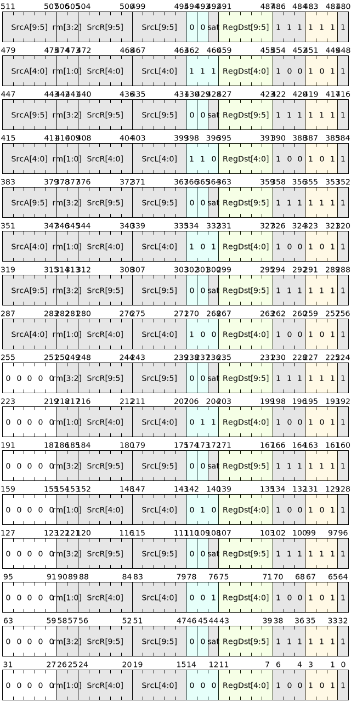

# 浮点运算指令

浮点运算类指令包括基础浮点加减乘除运算以及特殊的浮点运算，如开方，倒数，绝对值，正余弦等。

## 指令列表

浮点基础运算指令列表如下：

|     微指令    |         汇编格式                          |     描述       |
|--------------|-------------------------------------------|----------------|
| V.FADD   | `v.fadd SrcL.{T}, SrcR.{T}, ->Dst.{W}`   |  浮点加      |
| V.FSUB   | `v.fsub SrcL.{T}, SrcR.{T}, ->Dst.{W}`   |  浮点减      |
| V.FMUL   | `v.fmul SrcL.{T}, SrcR.{T}, ->Dst.{W}`   |  浮点乘      |
| V.FDIV   | `v.fdiv SrcL.{T}, SrcR.{T}, ->Dst.{W}`   |  浮点除      |
| V.FMADD  | `v.fmadd SrcL.{T}, SrcR.{T}, srcA.{T}, ->Dst.{W}`    |  浮点乘加  |
| V.FMSUB  | `v.fmsub SrcL.{T}, SrcR.{T}, srcA.{T}, ->Dst.{W}`    |  浮点乘减  |
| V.FNMADD | `v.fnmadd SrcL.{T}, SrcR.{T}, srcA.{T}, ->Dst.{W}`   |  浮点乘加取负  |
| V.FNMSUB | `v.fnmsub SrcL.{T}, SrcR.{T}, srcA.{T}, ->Dst.{W}`   |  浮点乘减取负  |

浮点特殊运算指令列表如下：

|     微指令    |         汇编格式                          |     描述       |
|--------------|-------------------------------------------|----------------|
| V.FABS   | `v.fabs SrcL.{T}, ->Dst.{W}`  |  浮点绝对值   |
| V.FSQRT  | `v.fsqrt SrcL.{T}, ->Dst.{W}` |  浮点平方根   |
| V.FEXP   | `v.fexp SrcL.{T}, ->Dst.{W}`  |  浮点以e为底的指数  |
| V.FRECIP  | `v.frecip SrcL.{T}, ->Dst.{W}` |  浮点取倒数  |
| V.FCLASS  | `v.fclass SrcL.{T}, ->Dst.H` |  判断浮点数据的类型 |

## 舍入模式

当计算结果无法精确表达需要进行舍入时，计算结果的舍入模式由[CSTATE](../../register/ssr/CSTATE.md)寄存器的FRM域段决定。如果FRM字段是无效的，那么默认采用RNE(就近舍入)模式对结果进行舍入。
