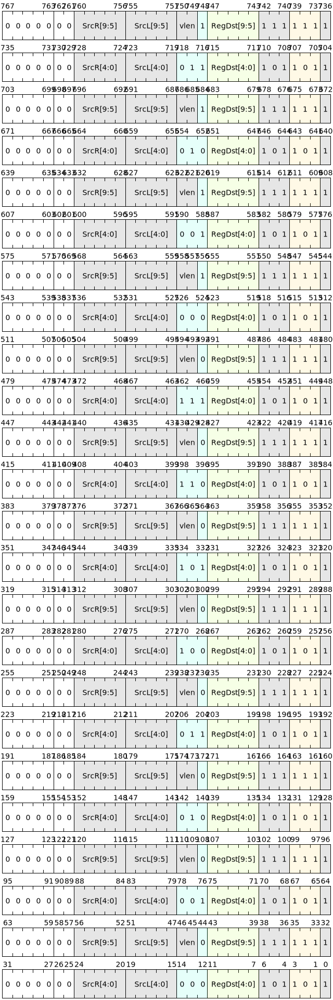

# 浮点比较类

浮点比较指令的每种操作码代表不同的比较条件，比较条件包括：相等比较，不等比较，大于等于比较和小于比较。

浮点比较指令从触发浮点例外的角度分为**静默比较Quiet Compare**和**发信比较Signaling Compare**：

- **静默比较**：任意操作数为SNaN，则触发无效操作数浮点异常。
- **发信比较**：任意操作数为NaN，则触发无效操作数浮点异常。

浮点比较指令根据本指令定义的条件对两个输入进行比较，并输出0或1。**如果任意操作数为NaN，那么输出结果为0**。

## 指令列表

|     微指令    | 汇编格式         |     描述                             |   QNaN是否触发异常   |
|--------------|------------------|--------------------------------------|--------------------|
| V.FEQ  | `v.feq SrcL.{T}, SrcR.{T}, ->Dst.{W}` |  浮点相等静默比较  |   否  |
| V.FNE  | `v.fne SrcL.{T}, SrcR.{T}, ->Dst.{W}` |  浮点不等静默比较  |   否  |
| V.FLT  | `v.flt SrcL.{T}, SrcR.{T}, ->Dst.{W}` |  浮点小于静默比较  |   否  |
| V.FGE  | `v.fge SrcL.{T}, SrcR.{T}, ->Dst.{W}` |  浮点大于等于静默比较  |   否  |
| V.FEQS | `v.feqs SrcL.{T}, SrcR.{T}, ->Dst.{W}` |  浮点相等信号比较  |   是  |
| V.FNES | `v.fnes SrcL.{T}, SrcR.{T}, ->Dst.{W}` |  浮点不等信号比较  |   是  |
| V.FLTS | `v.flts SrcL.{T}, SrcR.{T}, ->Dst.{W}` |  浮点小于信号比较  |   是  |
| V.FGES | `v.fges SrcL.{T}, SrcR.{T}, ->Dst.{W}` |  浮点大于等于信号比较  |   是  |

## 指令编码

