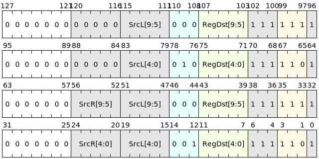

# 通用队列管理指令

GQM（General Queue Manager）是一种核间共享的硬件队列机制，用于系统范围内的异步数据传输、任务分发和跨核通讯。它提供了跨核的原子操作队列管理能力，能够在高并发访问场景下有效地减少锁和内存同步的开销。

GQM设计的目标是实现一种低延迟、可扩展的跨 功能模块 通讯机制，通过优化的队列读写协议来提升系统的通讯性能。

---

## GQM的实现原理

GQM的设计依赖以下核心原理来支持其多核间的通讯和数据交换：

1. **共享内存寻址机制**：GQM通过分配一片物理内存区域作为共享内存池，用于消息存储。所有需要通讯的核和模块都可以通过指令指定这一内存区域进行读写操作。

2. **独立寻址协议**：不同于传统的基于内存读写的通讯机制，GQM采用了独立的寻址协议，即每个核都通过GQM指令将数据压入或弹出队列。这样避免了多核读写共享内存的同步锁问题，通过GQM指令集的原子性和协议的管理，保证了队列操作的顺序和一致性。

3. **硬件控制的原子操作**：GQM指令由硬件管理，支持原子性的入队（push）和出队（pop）操作。指令操作完成时队列的更新状态已经被写入内存，不需要额外的锁保护机制或同步指令，减少了传统队列管理中的锁开销和死锁风险。

4. **协议优化**：GQM协议在内存访问性能和队列操作方面进行了优化，使得其在不适合使用内存一致性协议的多核场景下仍然能够保持高效。GQM可以限制对某个队列的同时访问量，即使队列访问的功能数量增加也不会导致性能急剧下降。

5. **缓存机制的支持**：为了进一步提高GQM的性能，GQM可以在内存中对缓存的消息片段进行小规模锁存，实现高速缓存管理。通过分批次的数据操作减少内存频繁写入的开销，进一步降低系统通讯的延迟。

---

## GQM指令集

并行块内的GQM指令包含三条核心指令，用于支持的数据传输操作包括入队（QPUSH）、出队（QPOP），使得通讯过程更加规范和高效。以下是指令的详细描述：

| 微指令      | 汇编格式                                 | 描述                                    |
|-------------|----------------------------------------|----------------------------------------|
| V.QPUSH   | `v.qpush SrcL.{T}, SrcR.{T}, ->Dst.{W}` | 将SrcR中的数据写入到SrcL指定的GQM队列中 |
| V.QPOP    | `v.qpop SrcL.{T}, ->Dst.{W}`            | 从SrcL指定的GQM队列中读取数据，返回执行结果 |

## 应用场景

GQM在高并发的核间通讯、任务分发、以及软硬件异构系统的多模块协作中具有重要的应用场景：

1. **跨核的异步任务分发**：在多核系统中，多个核心可以通过GQM队列实现任务的快速分发，适用于需要进行频繁任务调度和实时响应的应用。比如，操作系统可以使用GQM队列将任务分发给空闲的核心进行处理，减少任务分配的时间开销。

2. **多模块数据流传输**：GQM可以在不同模块之间实现数据流的无锁传输。适用于信号处理和大数据量处理场景中，需要模块间传递数据块或处理结果的需求。例如，在音视频处理系统中，每个处理阶段可以使用GQM队列将数据流无缝传递到下一个处理阶段，避免了缓存的复杂度和时延。

3. **硬件加速器和主核间通讯**：在需要加速的应用中，GQM允许主核和硬件加速器通过共享内存区域来完成高效的数据传递。硬件加速器通过GQM指令自动读取主核写入的数据，从而避免频繁的主核控制操作。

4. **多线程数据共享**：在需要快速线程间数据共享的场景下，GQM可以高效管理共享内存，不依赖额外的锁机制。适用于数据库系统中跨线程的查询结果缓存、日志系统的多线程处理等。

5. **低功耗设备的事件消息传递**：在需要实现异步消息传递的低功耗设备中，GQM队列机制可以替代传统的事件中断，减少系统的中断唤醒时间。同时也适合于网络协议栈中，实现多个网络模块间的事件队列传递，提高网络设备的功耗效率。

---

## GQM的优势

GQM在多核间异步通讯上带来了如下优势：

- **延迟低**：GQM避免了锁保护和同步机制带来的延迟，适合高频、低延迟场景。
- **高扩展性**：基于硬件控制的GQM指令即使在大量功能模块同时访问队列时也能保持较高性能，适用于复杂系统中的扩展场景。
- **原子性保障**：硬件层面保证了入队和出队的原子性，避免了并发操作中的数据一致性问题。
- **灵活性强**：GQM指令允许动态调整共享内存区域的地址和队列大小，方便适应不同任务的需求。

GQM在实现高效的核间通讯、提高模块协同效率方面具有显著的应用前景，尤其适用于多核处理器架构下需要高效数据交换的场景。

## 约束
- Load/Store指令不可以访问GQM队列内存
- GQM队列的最大空间是 2^10 字节
