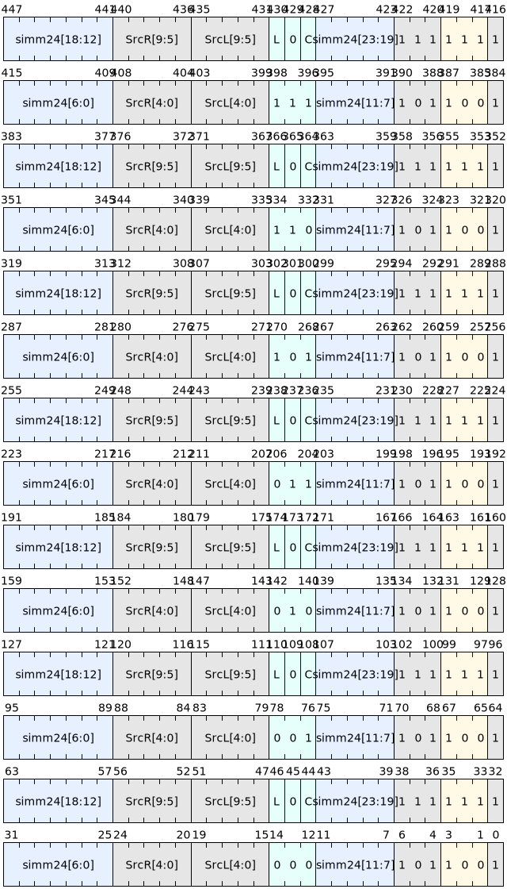

# 访存类指令

## 总体概述

- **执行范围与并行语义**：向量Load/Store指令在一个Group内的各lane以锁步方式并行执行。每个lane独立计算有效地址（EA）、发起访存，并对其对应的向量寄存器元素进行读写。
- **元素粒度与位宽**：操作对象为元素，元素位宽由指令确定，支持1、2、4、8字节。
- **有效地址统一范式**：EA由 “基址 + 偏移” 构成。偏移来源可为寄存器或立即数，并可按指令类型进行缩放（左移）或保持字节粒度（无缩放）。
- **数据扩展与存储**：Load对1/2/4字节数据提供符号扩展或无符号扩展的两类语义；8字节加载不扩展。Store严格按指令位宽写回，不涉及数据扩展。
- **对齐与未对齐访问**：缩放偏移形式面向自然对齐访问；无缩放形式允许字节粒度的未对齐访问。未对齐访问的性能与异常行为由实现定义。
- **结果与副作用**：Load将数据写入目标向量寄存器元素；Store将源向量寄存器元素写入目标地址空间。除访存外无额外寄存器输出。
- **异常与内存一致性**：异常与排序遵循体系结构的全局内存与异常模型。本节不单独定义屏障或同步语义。

## 向量Load指令

### **1.寄存器-寄存器寻址**

EA计算：`SrcL+(SrcR<< shamt), shamt有效范围为[0,31]`。

|  指令  |   数据扩展  |
|--------|----------------------|
| V.LB   | 加载1字节，符号扩展到元素指定位宽  |
| V.LH   | 加载2字节，符号扩展到元素指定位宽  |
| V.LW   | 加载4字节，符号扩展到元素执行位宽  |
| V.LD   | 加载8字节，无扩展（按64位写入）    |
| V.LBU  | 加载1字节，无符号扩展到元素指定位宽  |
| V.LHU  | 加载2字节，无符号扩展到元素指定位宽  |
| V.LWU  | 加载4字节，无符号扩展到元素指定位宽  |


适用场景：偏移来自寄存器且需以`2^shamt`缩放，便于表达步长访问、结构体字段间距或按元素大小的索引型访问。

### **寄存器-带缩放立即数寻址**

该寻址方式下，立即数偏移按照元素位宽自然对齐。

|  指令  | 数据扩展 | 有效地址  |
|--------|------------|-----------|
| V.LBI  | 加载1字节，符号扩展到元素指定位宽 |  SrcL + simm24 |
| V.LHI  | 加载2字节，符号扩展到元素指定位宽 |  SrcL + (simm24<<1) |
| V.LWI  | 加载4字节，符号扩展到元素指定位宽 |  SrcL + (simm24<<2) |
| V.LDI  | 加载8字节，无扩展（按64位写入）   |  SrcL + (simm24<<3) |
| V.LBUI | 加载1字节，无符号扩展到元素指定位宽 |  SrcL + simm24 |
| V.LHUI | 加载2字节，无符号扩展到元素指定位宽 |  SrcL + (simm24<<1) |
| V.LWUI | 加载4字节，无符号扩展到元素指定位宽 |  SrcL + (simm24<<2) |

其中，simm24为24位有符号立即数，参与EA计算前先按64位有符号扩展。

指令编码如下：


适用场景：索引为元素数目的立即数偏移，自动按元素位宽对齐，常用于数组基址加元素索引的访问。

### **寄存器-无缩放立即数寻址**

该寻址方式下，立即数偏移以字节为粒度。

|  指令  |  数据扩展  |  访存地址  |
|--------|-------------------|-----------|
| V.LHI.U  | 加载2字节，符号扩展到元素指定位宽  |  SrcL + simm24  |
| V.LWI.U  | 加载4字节，符号扩展到元素指定位宽  |  SrcL + simm24  |
| V.LDI.U  | 加载8字节，无扩展（按64位写入）    |  SrcL + simm24  |
| V.LHUI.U | 加载2字节，无符号扩展到元素指定位宽  |  SrcL + simm24  |
| V.LWUI.U | 加载4字节，无符号扩展到元素指定位宽  |  SrcL + simm24  |

其中，`.U`后缀表示不对立即数进行元素位宽缩放。

指令编码如下：


适用场景：需要精确控制字节偏移或进行未对齐访问的场合。

## 向量Store指令

Store指令不产生寄存器输出；写入目标由地址空间选择决定（见.local）。

### **寄存器-寄存器寻址**

采用寄存器-寄存器寻址的Store指令有三个源寄存器，其中SrcL和SrcR用于生成地址，SrcD用于提供待写数据元素。

|  指令  |  访存位宽  |  访存地址  |
|--------|-----------|-----------|
| V.SB   |  1字节  |  SrcL + (SrcR<<shamt)     |
| V.SH   |  2字节  |  SrcL + (SrcR<<(1+shamt)) |
| V.SW   |  4字节  |  SrcL + (SrcR<<(2+shamt)) |
| V.SD   |  8字节  |  SrcL + (SrcR<<(3+shamt)) |
| V.SH.U |  2字节  |  SrcL + (SrcR<<shamt)     |
| V.SW.U |  4字节  |  SrcL + (SrcR<<shamt)     |
| V.SD.U |  8字节  |  SrcL + (SrcR<<shamt)     |

其中，`.U`后缀表示对寄存器偏移不执行 “随元素位宽的附加左移”，仅按shamt进行缩放；无后缀的H/W/D变体在shamt基础上再按位宽附加左移，实现自然对齐步长。

指令编码如下：


### **寄存器-立即数寻址**

|  指令  |  访存位宽  |  访存地址  |
|--------|-----------|-----------|
| V.SBI   |  1字节  |  SrcL + simm24     |
| V.SHI   |  2字节  |  SrcL + (simm24<<1)  |
| V.SWI   |  4字节  |  SrcL + (simm24<<2)  |
| V.SDI   |  8字节  |  SrcL + (simm24<<3)  |
| V.SHI.U |  2字节  |  SrcL + simm24     |
| V.SWI.U |  4字节  |  SrcL + simm24     |
| V.SDI.U |  8字节  |  SrcL + simm24     |

其中，`.U`后缀表示不对立即数进行元素位宽缩放。

指令编码如下：



## 地址空间选择

所有向量Load/Store指令支持可选的.local标记，用于选择访存目标空间。

- 无.local：访问系统内存（经MMU/TLB、缓存等）。
- 带.local：访问Tile寄存器空间或本地可寻址的专用Tile存储阵列。
- 地址计算：.local不改变EA计算，仅改变访问路径与空间。
- 实现目的：显式空间选择减少硬件地址判定开销，便于端口仲裁、带宽管理与错误隔离。

异常与越界：

- 内存空间：遵循通用内存访问异常与权限模型。
- Tile空间：越界或未授权访问触发Tile空间访问异常（或实现定义的错误码）。
- 语义保持：数据位宽与扩展语义与非.local指令一致。

示例：
```asm
V.LW.local [SrcL + (SrcR << shamt)], ->Dst
V.SD.local SrcD, [SrcL + (simm24 << 3)]
```

## Group内连续地址访问

向量Load/Store指令支持Group内连续地址的访问方式，这种方式下，Load/Store指令默认带有一个 **LC0** 输入，用于作为地址计算的连续递增变量，并结合特定左移位数满足元素位宽的步幅。其余的地址计算输入，包括base和offset都必须是标量值，保证LC0是唯一变量。

连续性定义：设元素位宽为E（字节），lane索引为i=0..(VL-1)。若启用或依赖连续访问优化，则要求：
```c
EA(i+1) = EA(i) + E
```

连续访存：`Load [base, lc0<<shamt, offset]`；`Store [base, lc0<<shamt, offset], ->dst`。

其中base和offset必须保证在每个Group内是不变的，而lc0寄存器的值则会随着laneid递增而递增。同时`shamt`根据不同访存元素的位宽是固定的，例如：

- 加载1字节：`V.LB [base, lc0, offset]`，lc0等于0，1，2，3，...
- 加载2字节：`V.LH [base, lc0<<1, offset]`，lc0等于0，1，2，3，...
- 加载4字节：`V.LW [base, lc0<<2, offset]`，lc0等于0，1，2，3，...
- 加载8字节：`V.LD [base, lc0<<3, offset]`，lc0等于0，1，2，3，...

{ width="800" }

## 约束与实现细节

- 寄存器与向量形态：vd为目标向量寄存器；SrcL/SrcR/SrcD为源寄存器。lane数、向量长度与元素宽度由实现或编译环境配置。
- 地址计算宽度：在64位实现中，EA计算以64位进行。EA越界与地址空间限制的行为由实现定义。
- 扩展与访存字节数：扩展仅影响寄存器内的元素值表示，不改变访存字节数。Store严格按位宽写回。
- 内存一致性与同步：指令不自带屏障；与其他处理单元或外设进行严格排序或可见性保证时，应结合体系结构提供的同步/屏障指令。
- 掩码与异常：若体系结构支持向量掩码或逐lane异常抑制，其行为依向量控制与异常模型定义。

## 汇编示例（建议）

- Load（寄存器-寄存器）：`V.LW [SrcL + (SrcR << shamt)], ->Dst`
- Load（缩放立即数）：`V.LHI [SrcL + (simm24 << 1)], ->Dst`
- Load（无缩放立即数）：`V.LWI.U [SrcL + simm24], ->Dst`
- Store（寄存器-寄存器）：`V.SD SrcD, [SrcL + (SrcR << (3 + shamt))]`
- Store（缩放立即数）：`V.SWI SrcD, [SrcL + (simm24 << 2)]`
- Store（无缩放立即数）：`V.SDI.U SrcD, [SrcL + simm24]`
- 带.local：`V.LW.local [SrcL + (SrcR << 2)], ->Dst`；`V.SDI.local [SrcL + (simm24 << 3)]`
