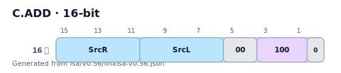
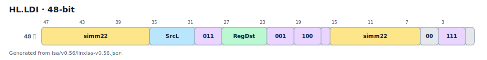

# 指令编码格式

> **ISA 版本：** v0.56.4 |  **ISA 手册第 03 章**

灵犀指令集 v0.56 支持小端字节序的四种指令长度
面向半字的模型。位位置显示为 `[msb:0]`
（MSB 最左边，LSB 最右边），匹配 ARM 和 RISC-V 约定。

## 指令长度

|命名空间 |格式|比特|成分|示例|
|------------|--------|------|-------------|---------|
| **C.** | C16 | C16 16 | 16单个 16 位部分 | `C.ADD`、`C.LD`、`C.BSTART.FP` |
| *（基础）* | LX32 | 32 | 32单个 32 位部分 | `ADD`、`LD`、`BSTART CALL` |
| **HL.** | HL48 | 48 | 48 16位前缀+32位主| `HL.LDI`、`HL.CASB`、`HL.SETRET` |
| **五.** | V64 | 64 | 64 32位前缀+32位主| `V.ADD`、`V.FMADD`、`V.DIV` |

> **注意：** 48 位 (`HL.*`) 和 64 位 (`V.*`) 形式是 *前缀 + 主* 组合。
> 前缀增强了以下指令，并且没有独立的语义。

## 解码格式标签

每条指令都带有一个解码 `Type` 标签，描述其操作数字段布局：

### 16 位 (C.) 解码类型

|标签 |典型操作数 |
|-----|-----------------|
| `C.Type A` | `SrcL`、`SrcR` — 两个寄存器 |
| `C.Type B` | `SrcL`、`uimm5` — 寄存器 + 小立即数 |
| `C.Type C` | `SrcL`、`Func`—寄存器+功能码|
| `C.Type D` | `SrcL`、`RegDst` — 寄存器移动 |
| `C.Type E` | `RegDst`、`uimm5` — 立即移动/设置 |
| `C.Type F` | `Func`、`uimm5` — 函数+小立即数 |
| `C.Type G` |仅立即（块标记）|
| `C.Type H` | `imm10` — 更大的立即 |
| `C.Type I` | `imm12` — PC 相关形式 |

### 32 位解码类型

|标签 |典型操作数 |
|-----|-----------------|
| `Type A` | `RegDst`、`SrcL`、`SrcR` [、`SrcD`] — 3 源 |
| `Type B` | `RegDst`、`SrcL`、`SrcR` + 小 `imm` |
| `Type C` | `SrcL`、`SrcR` + 2 个立即数 |
| `Type D` | `RegDst`、`SrcL` + `simm` — 比较/分支 |
| `Type F` | `RegDst`、`SrcL` + `simm` — 加载/存储 |
| `Type G` | `RegDst` + `simm` — 立即加载 |
| `Type H` | `SrcL`、`SrcR` + `simm` — ALU-立即 |

## 编码空间

|编码 |主要操作码位 |老虎机|用途 |
|----------|-----------------|--------|--------|
| C16 | C16 `[15:13]` | 8 |压缩 16 位形式 |
| LX32 | `[31:26]` | 64 | 64基本 32 位形式 |
| HL48 | `[47:40]` | 256 | 256高级前缀 |
| V64 | `[63:58]` | 64 | 64矢量前缀|完整内容请参见【编码空间分析】(../reference/encoding_space_report.md)
无冲突分配表。

## 字段颜色键

|颜色 |领域|颜色 |领域|
|--------|--------|--------|--------|
|绿色|路/RegDst |紫色|函数/操作码 |
|青色 | Rs1 / SrcL |粉色|沙姆特 |
|青色|卢比/SrcR |琥珀 | imm / 偏移 |
|橙色| 3卢比/SrcD |灰色|保留/零 |

## 示例图

### 32 位：添加

### 16 位：C.ADD

### 48 位：HL.LDI

### 64 位：V.ADD

## 另请参阅

- [完整 ISA 手册概述](https://github.com/ZXTERMEN40QXZ/linx-isa/tree/main/docs/architecture/isa-manual/src)
- [指令参考索引](index.md)
- [编码空间分析](../reference/encoding_space_report.md)
