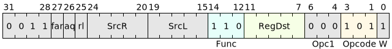

# HL.CASD

## 说明

原子比较交换·双字(*Compare and Swap Doubleword*)  
本指令执行如下的原子操作：从寄存器SrcL指定的内存位置加载`64位`数据，与寄存器SrcR的值进行比较，如果相同的话，就把寄存器SrcD的值存入原内存中。不管前面比较的结果如何，将从内存读取的`64位`数据写入目的寄存器中。

## 汇编语法

```asm
    hl.casd<.{aq, rl, f, aqrl, aqf, rlf, aqrlf}> [SrcL], SrcR, SrcD, ->{t, u, Rd}
```

## 汇编符号

- **SrcL**：源寄存器，可以索引全局寄存器R0-R23和前序1-4条输出至T队列或U队列的指令结果。
- **SrcR**：源寄存器，可以索引全局寄存器R0-R23和前序1-4条输出至T队列或U队列的指令结果。
- **SrcD**：源寄存器，可以索引全局寄存器R0-R23和前序1-4条输出至T队列或U队列的指令结果。
- **->**：用于指示目的寄存器。
- **{t,u,Rd}**：表示三种可选的目的寄存器，编码于RegDst域。其中：
    - **t,u**：分别表示块内的T和U寄存器队列。
    - **Rd**：可以索引全局寄存器R1-R23。
- **.aq,.rl**：内存访问限制，详见[原子指令](../../blockIntro/sys_block/atomic.md)
- **.f**：指令可选后缀，表示内存访问发生在远端Cache中。

## 编码格式

- 低16bit编码：


- 高32bit编码：



## 执行方式

- 转换为十进制数：[UInt()](../LibPseudoCode.md)
- 通用寄存器读写：[R\[\]](../LibPseudoCode.md)

```c
    integer d = UInt(RegDst);
    integer m = UInt(SrcL);
    integer n = UInt(SrcR);
    integer p = UInt(SrcD);

    Atomic {
        bits(64) address  = R[m, 64];
        bits(64) cmpvalue = R[n, 64];
        bits(64) newvalue = R[p, 64];
        bits(64) oldvalue = Mem[address];

        if oldvalue == cmpvalue then
            Mem[address] = newvalue;
        R[d, 64] = oldvalue;
    }
```

## 汇编索引模式

指令输出到块内t寄存器:
```asm
hl.casd   [a1], a2, a3,          ->t            /*三寄存器绝对索引*/
hl.casd   [a1], t#2, u#3,        ->t            /*三寄存器混合索引*/
hl.casd   [a1], u#2, t#3,        ->t            /*三寄存器混合索引*/
hl.casd   [t#1], a2, u#3,        ->t            /*三寄存器混合索引*/
hl.casd   [t#1], u#2, a3,        ->t            /*三寄存器混合索引*/
hl.casd   [t#1], t#2, t#3,       ->t            /*三寄存器相对索引*/
hl.casd   [u#1], a2, t#3,        ->t            /*三寄存器混合索引*/
hl.casd   [u#1], t#2, a3,        ->t            /*三寄存器混合索引*/
hl.casd   [u#1], u#2, u#3,       ->t            /*三寄存器相对索引*/
hl.casd.aq   [a1], t#2, u#3,     ->t            /*可选择.aq, .rl或.f的内存访问限制*/
hl.casd.aq   [t#1], a2, u#3,     ->t            /*可选择.aq, .rl或.f的内存访问限制*/
hl.casd.aq   [u#1], a2, t#3,     ->t            /*可选择.aq, .rl或.f的内存访问限制*/
```

指令输出到块内u寄存器:
```asm
hl.casd   [a1], a2, a3,          ->u            /*三寄存器绝对索引*/
hl.casd   [a1], t#2, u#3,        ->u            /*三寄存器混合索引*/
hl.casd   [a1], u#2, t#3,        ->u            /*三寄存器混合索引*/
hl.casd   [t#1], a2, u#3,        ->u            /*三寄存器混合索引*/
hl.casd   [t#1], u#2, a3,        ->u            /*三寄存器混合索引*/
hl.casd   [t#1], t#2, t#3,       ->u            /*三寄存器相对索引*/
hl.casd   [u#1], a2, t#3,        ->u            /*三寄存器混合索引*/
hl.casd   [u#1], t#2, a3,        ->u            /*三寄存器混合索引*/
hl.casd   [u#1], u#2, u#3,       ->u            /*三寄存器相对索引*/
hl.casd.aq   [a1], t#2, u#3,     ->u            /*可选择.aq, .rl或.f的内存访问限制*/
hl.casd.aq   [t#1], a2, u#3,     ->u            /*可选择.aq, .rl或.f的内存访问限制*/
hl.casd.aq   [u#1], a2, t#3,     ->u            /*可选择.aq, .rl或.f的内存访问限制*/
```

指令输出到全局R1-R23寄存器:
```asm
hl.casd   [a1], a2, a3,          ->a4            /*三寄存器绝对索引*/
hl.casd   [a1], t#2, u#3,        ->a4            /*三寄存器混合索引*/
hl.casd   [a1], u#2, t#3,        ->a4            /*三寄存器混合索引*/
hl.casd   [t#1], a2, u#3,        ->a4            /*三寄存器混合索引*/
hl.casd   [t#1], u#2, a3,        ->a4            /*三寄存器混合索引*/
hl.casd   [t#1], t#2, t#3,       ->a4            /*三寄存器相对索引*/
hl.casd   [u#1], a2, t#3,        ->a4            /*三寄存器混合索引*/
hl.casd   [u#1], t#2, a3,        ->a4            /*三寄存器混合索引*/
hl.casd   [u#1], u#2, u#3,       ->a4            /*三寄存器相对索引*/
hl.casd.aq   [a1], t#2, u#3,     ->a4            /*可选择.aq, .rl或.f的内存访问限制*/
hl.casd.aq   [t#1], a2, u#3,     ->a4            /*可选择.aq, .rl或.f的内存访问限制*/
hl.casd.aq   [u#1], a2, t#3,     ->a4            /*可选择.aq, .rl或.f的内存访问限制*/
```

## 约束

- 本指令要求**内存访问地址必须8字节对齐**，否则触发地址不对齐异常。
- 本指令属于[增强指令扩展](../../instset/haflLongInstrs.md)，且**仅允许在系统块内使用**。
