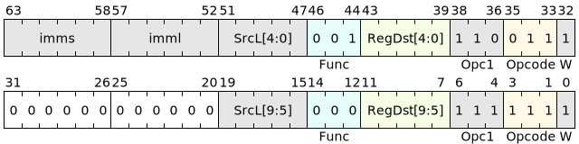

# V.BXU

## 说明

无符号位提取(*Bit eXtract Unsigned*)<br>
从源操作数的第 `M` 位开始连续截取 `N` 位，无符号扩展后写入目的寄存器中。

## 汇编语法

```asm
    v.bxu SrcL<.reuse>.{T}, M, N, ->RegDst.{W}
```

## 汇编符号

- **SrcL**：左源寄存器，可以索引的寄存器类型请见[向量指令介绍](../../blockIntro/vecinstrs/instIntro.md)。
- **reuse**：当源寄存器为向量寄存器时可增加本后缀，用于指示当前指令提交后本寄存器不允许被释放。如无此标识，则表示允许硬件释放本寄存器。
- **T**：指定操作数的数据类型，可选类型包括sb,sh,sw,sd,ub,uh,uw,ud等。
- **M**：开始截取的比特位，取值范围为：[63, 0]。该参数编码于imms字段。
- **N**：连续截取的比特位数，取值范围为：[64, 1]。该参数减1后编码于imml字段。
- **->**：用于指示目的寄存器。
- **RegDst**: 目的寄存器，可以索引的寄存器类型请见[向量指令介绍](../../blockIntro/vecinstrs/instIntro.md)。
- **W**：目的寄存器的位宽标识，包括b,h,w,d等。

!!! note "注意事项！"

    M和N的取值必须小于源寄存器位宽，否则硬件执行结果不可知。

## 编码格式



## 执行方式

- 解码输入参数：[DecodeINT](../LibPseudoCode.md#locationL)
- 解码输出参数：[DecodeDst](../LibPseudoCode.md#locationN)
- 通用寄存器读写：[V\[\]](../LibPseudoCode.md#locationB)
- 转换为十进制数：[UInt()](../LibPseudoCode.md#locationA)

```c
bits(64) pmask = P;   // lane掩码
// lanenum表示当前Group内lane的数量
for (laneid = 0; laneid < lanenum; laneid++)
{
    integer {m, srcwidth}  = DecodeINT(SrcL);
    integer M = UInt(imms);
    integer N = UInt(imml) + 1;
    integer {d, dstwidth} = DecodeDst(RegDst); 

    if (pmask[laneid] == 1) {
        bits(srcwidth) operand = V[m, srcwidth, laneid];
        bits(srcwidth*2) newoperand = (operand << srcwidth) | operand;

        bits(srcwidth) result = ZeroExtend(newoperand[M+N-1:M]);

        V[d, dstwidth, laneid] = result;  // 根据输出寄存器位宽对结果进行截断
    }
    else {
        V[d, dstwidth, laneid] = 0;  // 无效lane中默认写0
    }
}
```

当 **M+N <= 64** 时：

{ width="800" }

当 **M+N > 64** 且 **N < 64** 时：

{ width="500" }

当 **M+N > 64** 且 **N == 64** 时：

{ width="500" }

## 汇编举例

由上面 **M > 0** 且 **N == 64** 时的实现可以看到，该指令对操作数实现了循环移位。

v.bxu指令实现循环移位的方式如下：

**实现循环左移rol**
```c
v.bxu SrcL<.reuse>.{T}, M, 64, ->RegDst.{W}    /* M = 64 - shamt */
```
此时需将 M 设置为XLEN(即64)减去循环左移的位数后的值。

**实现循环右移ror**
```c
v.bxu SrcL<.reuse>.{T}, M, 64, ->RegDst.{W}    /* M = shamt */
```
此时需将 M 设置为循环右移的位数。

## 备注

本指令属于[超长指令扩展](../../instset/longInstrs.md)，可用于向量数据块或访存数据块中。
