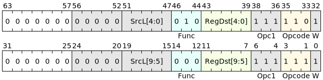

# V.QPOP

## 说明

出队列(*Pop from Queue*)<br>
该指令读出由 左源操作数 指定的GQM队列的数据并输出至目的寄存器。同时如果读出成功，返回**状态0**，如果读出失败，返回**状态1**。

如果当前lane中读出失败，则将对应掩码置为无效且在输出寄存器中写入0。

## 汇编语法

```asm
    v.qpop SrcL<.reuse>.ud, ->Dst.d
```

## 汇编符号

- **SrcL**：左源寄存器，可以索引的寄存器类型请见[向量指令介绍](../../blockIntro/vecinstrs/instIntro.md)。
- **reuse**：当源寄存器为向量寄存器时可增加本后缀，用于指示当前指令提交后本寄存器不允许被释放。如无此标识，则表示允许硬件释放本寄存器。
- **T**：指令操作数的浮点类型标识，包括sb,sh,sw,sd,ub,uh,uw,ud。
- **->**：用于指示目的寄存器。
- **RegDst**: 目的寄存器，可以索引的寄存器类型请见[向量指令介绍](../../blockIntro/vecinstrs/instIntro.md)。
- **.d**：表示目的寄存器的位宽为64位。

## 编码格式



## 执行方式

- 解码输入参数：[DecodeINT](../LibPseudoCode.md#locationL)
- 解码输出参数：[DecodeDst](../LibPseudoCode.md#locationN)
- 通用寄存器读写：[V\[\]](../LibPseudoCode.md#locationB)

```c
bits(64) pmask = P;   // lane掩码
// lanenum表示当前Group内lane的数量
for (laneid = 0; laneid < lanenum; laneid++)
{
    integer {m, srctype}  = DecodeINT(SrcL);
    integer {d, dstwidth} = DecodeDst(RegDst); 

    integer state;
    bit(64) data;

    if (pmask[laneid] == 1) {
        bits(64) address = V[m, srctype, laneid];
        {state, data} = GQM[address].pop();

        if state == 1 then                      // 读出失败
            V[d, dstwidth, laneid] = 0;
        else
            V[d, dstwidth, laneid] = data;     // 读出成功
    }
    else {
        V[d, dstwidth, laneid] = 0;  // 无效lane中默认写0
    }
}
```

!!! note "注意"
    如果当前lane中pop失败，则将对应掩码置为0。

## 备注

本指令属于[超长指令扩展](../../instset/longInstrs.md)，可用于向量数据块或访存数据块中。
