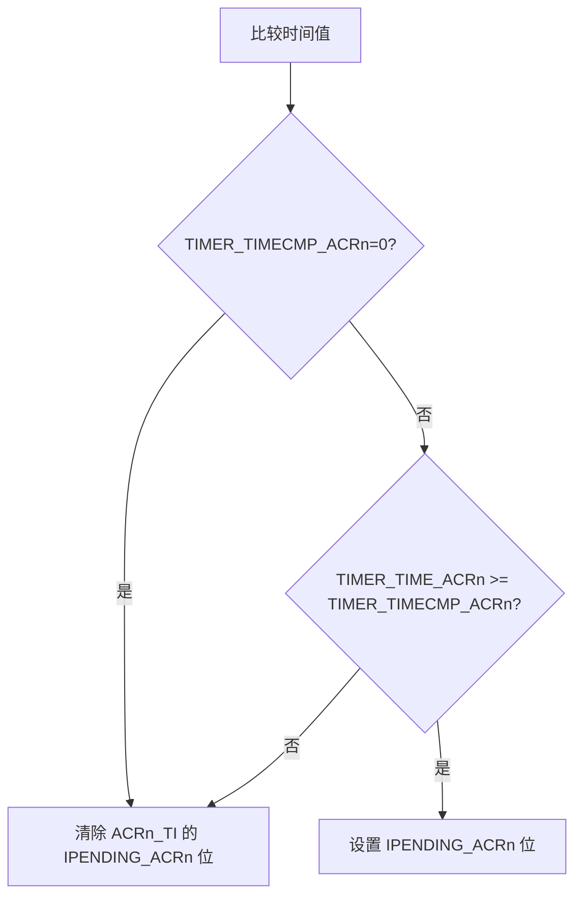

# 通用定时器

灵犀核（LxLC）在部分ACR上提供通用的定时器功能。通用定时器实现为针对ACRn_TI的一个`Xproxy`，详见[ACR中断](../isa/exception/interrupt.md)文档。

版本说明：当前版本中，通用定时器仅在ACR1中提供。

## 配置寄存器

对于支持的任意ACR n，通用定时器通过以下系统寄存器SSR配置：

- [TIMER_TIME_ACRn](./register/ssr/TIMER_TIME.md)：内部存储一个64位无符号整数，在灵犀核（LxLC）复位后持续按固定的周期增加。
- [TIMER_TIMECMP_ACRn](./register/ssr/TIMER_TIMECMP.md)：同样存储一个64位无符号整数，用于和 `TIMER_TIME_ACRn` 比较决定是否触发。
  
`TIMER_TIME_ACRn` 和 `TIMER_TIMECMP_ACRn` 在LxLC热、冷复位的时候都**初始化为0**，之后可通过写入SSR修改。

系统寄存器 `TIMER_TIME_ACRn` 周期性增加，增加的频度和计数的单位实现相关，但必须低于1ms，如果计数器溢出其表达范围，从0开始重新计算。如果该SSR被改写，下次更新基于改写的值增加。

## 定时器触发逻辑

当更新TIMER_TIME_ACRn或TIMER_TIMECMP_ACRn时，系统比较两者值：

- 如果 `TIMER_TIMECMP_ACRn` 为0，清除ACRn_TI的 `IPENDING_ACRn` 位。
- 如果 `TIMER_TIMECMP_ACRn` 非0：
    - 如果 `TIMER_TIME_ACRn` 大于或者等于 `TIMER_TIMECMP_ACRn` ，设置ACRn_TI的 `IPENDING_ACRn` 位。
    - 反之，如果 `TIMER_TIME_ACRn` 小于 `TIMER_TIMECMP_ACRn` ，清除ACRn_TI的 `IPENDING_ACRn` 位。

## 注意事项

这个接口意味着通用定时器不能被灵犀核（LxLC）之外的实体修改。同时，在定时器触发后，如果不需要再次收到这个定时器，需要主动对 `TIMER_TIMECMP_ACRn` 写零。
